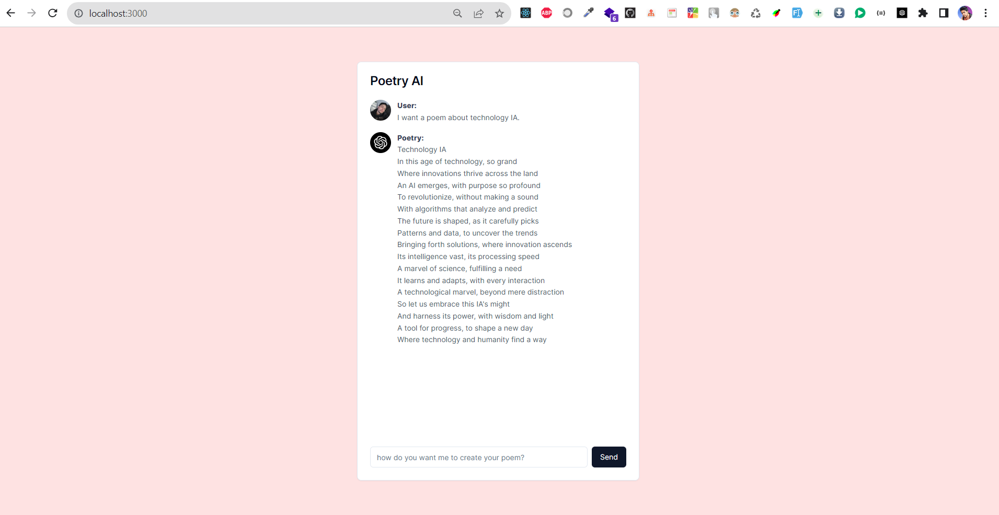

# Image about RhymeWizard



# Turborepo starter

This is an official starter Turborepo.

## What's inside?

This Turborepo includes the following packages/apps:

### Apps and Packages

- `back`: a [Flask](https://flask.palletsprojects.com/en/2.3.x/) app
- `web`: another [Next.js](https://nextjs.org/) app
- `eslint-config-custom`: `eslint` configurations (includes `eslint-config-next` and `eslint-config-prettier`)
- `tsconfig`: `tsconfig.json`s used throughout the monorepo

### Utilities

This Turborepo has some additional tools already setup for you:

- [TypeScript](https://www.typescriptlang.org/) for static type checking
- [ESLint](https://eslint.org/) for code linting
- [Prettier](https://prettier.io) for code formatting

### Develop

To develop all apps and packages, run the following command:

```
cd my-turborepo
npm i
cd apps/back
pip install -r requirements.txt
cd ../..
npm run build
npm run start
```
